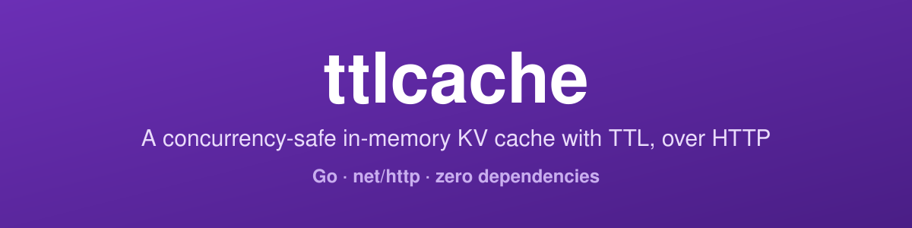
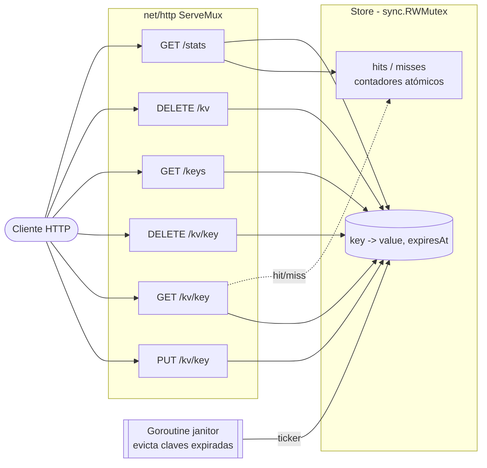

<!-- ══════════════════════════ PORTADA ══════════════════════════ -->
<div align="center">
  
</div>

<!-- ══════════════════════ IDIOMAS / LANGUAGES ══════════════════════ -->
<div align="center">
<a href="README.md"></a>
<a href="README.en.md"></a>
<a href="README.es.md"></a>
</div>

<div align="center">
  
</div>

<h1 align="center">ttlcache</h1>
<p align="center"><em>Caché clave-valor en memoria, thread-safe, con TTL por clave, expuesto vía HTTP</em></p>
<p align="center"><strong>PUT/GET/DELETE en /kv/{key} → janitor en background → stats de hit/miss</strong></p>

<div align="center">
<a href="https://github.com/geoggrigori/ttlcache/actions/workflows/ci.yml"></a>


</div>

<div align="center">
<a href="#acerca-de"></a>
<a href="#arquitectura"></a>
<a href="#api-http"></a>
<a href="#uso"></a>
</div>

<br/>

> ⚡ **Cero dependencias** — 100% biblioteca estándar de Go. Nada que descargar, nada que mantener actualizado.

## Acerca de

**ttlcache** es un caché clave-valor en memoria, thread-safe, con **TTL por clave**, servido vía HTTP. Construido enteramente sobre la standard library de Go.

**Destacados:**
- **TTL por clave** — cada entrada expira independientemente; las entradas expiradas se leen como ausentes.
- **Thread-safe** — el store está protegido por `sync.RWMutex` y pasa `go test -race`.
- **Janitor en background** — una goroutine evicta periódicamente las claves expiradas, así la memoria no crece sin límite.
- **Stats de hit/miss** — rastreados con contadores atómicos, expuestos como JSON.
- **API HTTP minúscula** — `PUT`/`GET`/`DELETE` en `/kv/{key}`, más `/keys`, flush y `/stats`, usando el `ServeMux` basado en patrones de Go 1.22+.

## Arquitectura



## Build & run

```sh
go build ./...
go run .            # levanta el servidor en :8080
```

## API HTTP

| Método | Ruta | Descripción |
|---|---|---|
| `PUT` | `/kv/{key}` | Guarda el cuerpo de la petición. TTL vía `?ttl=` o `X-TTL`. |
| `GET` | `/kv/{key}` | Devuelve el valor, o `404` si está ausente/expirado. |
| `DELETE` | `/kv/{key}` | Elimina la clave. Siempre `204`. |
| `GET` | `/keys` | Array JSON de las claves actualmente no expiradas. |
| `DELETE` | `/kv` | Limpia todo el caché. Siempre `204`. |
| `GET` | `/stats` | Snapshot JSON: `items`, `hits`, `misses`. |

```sh
curl -X PUT "http://localhost:8080/kv/greeting?ttl=30s" --data "hello"
curl "http://localhost:8080/kv/greeting"        # hello
curl -X DELETE "http://localhost:8080/kv/greeting"
curl "http://localhost:8080/keys"               # ["greeting","session"]
curl "http://localhost:8080/stats"              # {"items":1,"hits":3,"misses":1}
```

## Configuración

| Flag | Env | Predeterminado | Descripción |
|---|---|---|---|
| `-port` | `PORT` | `8080` | Puerto TCP |
| `-ttl` | `TTL` | `1m` | TTL predeterminado cuando la petición omite uno |
| `-janitor-interval` | `JANITOR_INTERVAL` | `30s` | Frecuencia de evicción del janitor |

## Uso

```sh
go test ./...          # todas las pruebas
go test -race ./...    # bajo el detector de race
```

La suite cubre set/get, expiración (vía reloj inyectable), delete, evicción del janitor, `Set`/`Get` concurrente bajo `-race`, y los handlers HTTP vía `httptest`.

## Licencia

[MIT](LICENSE).

<div align="center">
  
</div>

<p align="center"><sub>Desarrollado por <strong><a href="https://github.com/geoggrigori">Grigori</a></strong> · 2026</sub></p>
