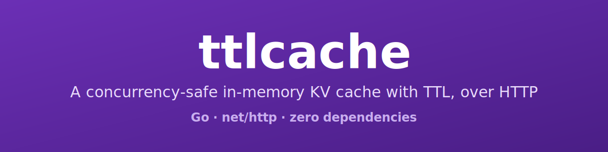
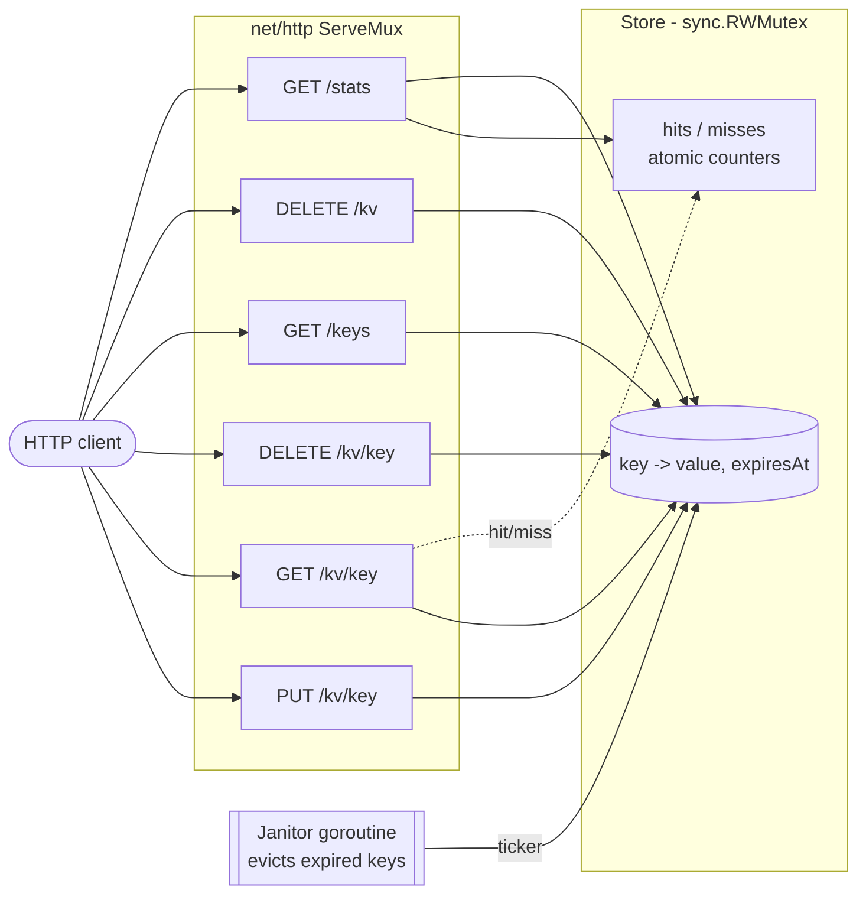

[](https://github.com/geoggrigori/ttlcache/actions/workflows/ci.yml)

[](https://go.dev/)
[](LICENSE)
[](go.mod)
[](#running-tests)

# ttlcache

A small, concurrency-safe in-memory key-value cache with per-key TTL, served over HTTP.
It is built entirely on the Go standard library, so there is nothing to download and
nothing to keep up to date.

## Features

- **Per-key TTL** — every entry expires independently; expired entries read as missing.
- **Concurrency-safe** — the store is guarded by a `sync.RWMutex` and passes `go test -race`.
- **Background janitor** — a goroutine periodically evicts expired keys so memory does not grow unbounded.
- **Hit / miss stats** — tracked with atomic counters and exposed as JSON.
- **Tiny HTTP API** — `PUT` / `GET` / `DELETE` on `/kv/{key}`, plus `/keys`, cache flush, and a `/stats` endpoint, using the Go 1.22+ pattern-based `ServeMux`.
- **Zero dependencies** — standard library only.

## Architecture



## Build & run

```sh
go build ./...      # compile
go run .            # start the server on :8080
```

```
2026/06/16 12:00:00 ttlcache listening on :8080 (default ttl 1m0s, janitor interval 30s)
```

## HTTP API

| Method   | Path         | Description                                              |
| -------- | ------------ | -------------------------------------------------------- |
| `PUT`    | `/kv/{key}`  | Store the request body. TTL from `?ttl=` or `X-TTL`.     |
| `GET`    | `/kv/{key}`  | Return the value, or `404` if missing/expired.           |
| `DELETE` | `/kv/{key}`  | Remove the key. Always `204`.                            |
| `GET`    | `/keys`      | JSON array of the currently non-expired keys.            |
| `DELETE` | `/kv`        | Flush the entire cache. Always `204`.                    |
| `GET`    | `/stats`     | JSON snapshot: `items`, `hits`, `misses`.                |

### curl examples

```sh
# Store a value with a 30s TTL (via query string)
curl -X PUT "http://localhost:8080/kv/greeting?ttl=30s" --data "hello"
# (204 No Content)

# Or set the TTL via header
curl -X PUT "http://localhost:8080/kv/session" -H "X-TTL: 5m" --data "abc123"

# Read it back
curl "http://localhost:8080/kv/greeting"
# hello

# Delete it
curl -X DELETE "http://localhost:8080/kv/greeting"
# (204 No Content)

# Reading an expired (or unknown) key returns 404
curl -i "http://localhost:8080/kv/greeting?ttl=1s"   # PUT, wait > 1s, then GET
curl -i "http://localhost:8080/kv/greeting"
# HTTP/1.1 404 Not Found
# not found

# List the currently non-expired keys
curl "http://localhost:8080/keys"
# ["greeting","session"]

# Flush the entire cache
curl -X DELETE "http://localhost:8080/kv"
# (204 No Content)

# Cache statistics
curl "http://localhost:8080/stats"
# {"items":1,"hits":3,"misses":1}
```

## Configuration

Each option can be set with a flag or an environment variable; the flag takes precedence.

| Flag                 | Env                | Default | Description                                  |
| -------------------- | ------------------ | ------- | -------------------------------------------- |
| `-port`              | `PORT`             | `8080`  | TCP port to listen on.                       |
| `-ttl`               | `TTL`              | `1m`    | Default TTL when a request omits one.        |
| `-janitor-interval`  | `JANITOR_INTERVAL` | `30s`   | How often the janitor evicts expired keys.   |

```sh
PORT=9000 TTL=2m JANITOR_INTERVAL=10s go run .
# or
go run . -port 9000 -ttl 2m -janitor-interval 10s
```

## Running tests

```sh
go test ./...          # all unit and HTTP tests
go test -race ./...    # the same suite under the race detector
```

The suite covers set/get, expiry (via an injectable clock), delete, janitor eviction,
concurrent `Set`/`Get` under `-race`, and the HTTP handlers through `httptest`.

## License

Released under the [MIT License](LICENSE). Copyright (c) 2026 Geovana Grigorio.
