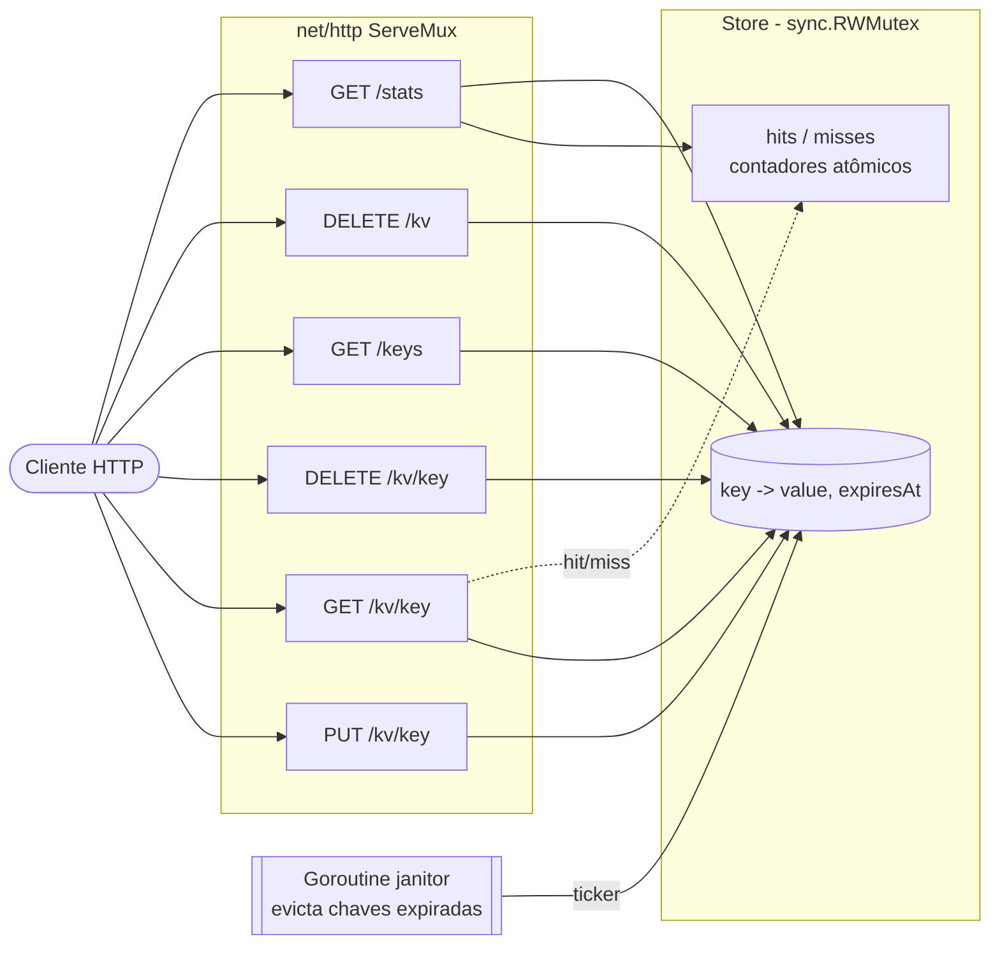

<!-- ══════════════════════════ TÍTULO ══════════════════════════ -->
<div align="center">
  
</div>

<!-- ══════════════════════ IDIOMAS / LANGUAGES ══════════════════════ -->
<div align="center">
<a href="README.md"></a>
<a href="README.en.md"></a>
<a href="README.es.md"></a>
</div>

<h1 align="center">ttlcache</h1>
<p align="center"><em>Cache chave-valor em memória, thread-safe, com TTL por chave, exposto via HTTP</em></p>
<p align="center"><strong>PUT/GET/DELETE em /kv/{key} → janitor em background → stats de hit/miss</strong></p>

<div align="center">
<a href="https://github.com/geoggrigori/ttlcache/actions/workflows/ci.yml"></a>


</div>

<div align="center">
<a href="#sobre"></a>
<a href="#arquitetura"></a>
<a href="#api-http"></a>
<a href="#uso"></a>
</div>

<br/>

> ⚡ **Zero dependências** — 100% biblioteca padrão do Go. Nada pra baixar, nada pra manter atualizado.

## Sobre

**ttlcache** é um cache chave-valor em memória, thread-safe, com **TTL por chave**, servido via HTTP. Construído inteiramente sobre a standard library do Go.

**Destaques:**
- **TTL por chave** — cada entrada expira independentemente; entradas expiradas são lidas como ausentes.
- **Thread-safe** — o store é protegido por `sync.RWMutex` e passa em `go test -race`.
- **Janitor em background** — uma goroutine evicta periodicamente as chaves expiradas, então a memória não cresce sem limite.
- **Stats de hit/miss** — rastreados com contadores atômicos, expostos como JSON.
- **API HTTP minúscula** — `PUT`/`GET`/`DELETE` em `/kv/{key}`, mais `/keys`, flush e `/stats`, usando o `ServeMux` baseado em padrões do Go 1.22+.

## Arquitetura


```mermaid
flowchart LR
    client([Cliente HTTP])

    subgraph srv[net/http ServeMux]
        put[PUT /kv/key]
        get[GET /kv/key]
        del[DELETE /kv/key]
        keys[GET /keys]
        flush[DELETE /kv]
        stats[GET /stats]
    end

    subgraph store[Store - sync.RWMutex]
        m[(key -> value, expiresAt)]
        counters[hits / misses<br/>contadores atômicos]
    end

    janitor[[Goroutine janitor<br/>evicta chaves expiradas]]

    client --> put --> m
    client --> get --> m
    get -. hit/miss .-> counters
    client --> del --> m
    client --> keys --> m
    client --> flush --> m
    client --> stats --> counters
    stats --> m
    janitor -- ticker --> m
```

## Build & run

```sh
go build ./...
go run .            # sobe o servidor em :8080
```

## API HTTP

| Método | Rota | Descrição |
|---|---|---|
| `PUT` | `/kv/{key}` | Salva o corpo da requisição. TTL via `?ttl=` ou `X-TTL`. |
| `GET` | `/kv/{key}` | Retorna o valor, ou `404` se ausente/expirado. |
| `DELETE` | `/kv/{key}` | Remove a chave. Sempre `204`. |
| `GET` | `/keys` | Array JSON das chaves atualmente não expiradas. |
| `DELETE` | `/kv` | Limpa o cache inteiro. Sempre `204`. |
| `GET` | `/stats` | Snapshot JSON: `items`, `hits`, `misses`. |

```sh
curl -X PUT "http://localhost:8080/kv/greeting?ttl=30s" --data "hello"
curl "http://localhost:8080/kv/greeting"        # hello
curl -X DELETE "http://localhost:8080/kv/greeting"
curl "http://localhost:8080/keys"               # ["greeting","session"]
curl "http://localhost:8080/stats"              # {"items":1,"hits":3,"misses":1}
```

## Configuração

| Flag | Env | Padrão | Descrição |
|---|---|---|---|
| `-port` | `PORT` | `8080` | Porta TCP |
| `-ttl` | `TTL` | `1m` | TTL padrão quando a requisição omite um |
| `-janitor-interval` | `JANITOR_INTERVAL` | `30s` | Frequência de evicção do janitor |

## Uso

```sh
go test ./...          # todos os testes
go test -race ./...    # sob o detector de race
```

A suíte cobre set/get, expiração (via clock injetável), delete, evicção do janitor, `Set`/`Get` concorrente sob `-race`, e os handlers HTTP via `httptest`.

## Licença

[MIT](LICENSE).

<div align="center">
  
</div>

<p align="center"><sub>Desenvolvido por <strong><a href="https://github.com/geoggrigori">Grigori</a></strong> · 2026</sub></p>
